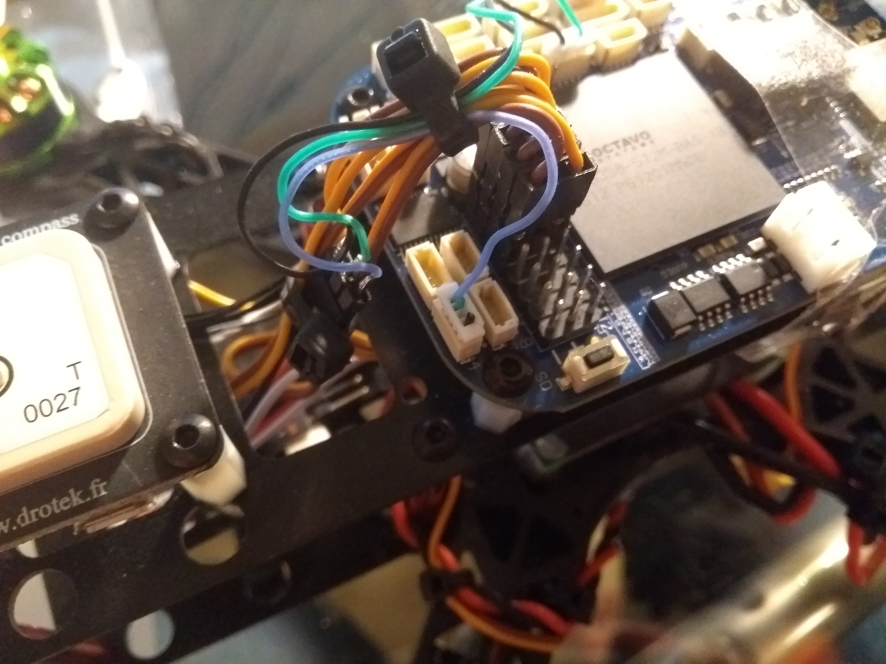

# BeagleBone Blue
Howto use [BeagleBone Blue](https://github.com/jadonk/beaglebone-blue) with [ArduPilot](https://github.com/ArduPilot/ardupilot)

# Hardware

## Receiver
Since 17.01.2018 you can use the DSM2 connector or connector E4 pin 4 on your BealgeBone Blue.

Before 17.01.2018 the RC receiver signal has to be connected to connector E4 pin 4. This pin is a multi protocol pin (S.BUS, PPM-Sum, Spektrum Satellit DSM), the protocol will be automatically detected. Make sure the signal does not exceed 3.3 volts, otherwise your BeagleBone Blue can be damaged.

### Tested receiver

Name | Protocol | DSM2 connector | E4 connector (pin 4) | Voltage divider needed
-----|----------|----------------|----------------------|-----------------------
FrSky X8R | SBUS | not tested | working | no, 3.3V output
FrSky X6R | SBUS | not tested | working | no, 3.3V output
OrangeRx Satellite Receiver | DSM | working | not tested | no, 3.3V output

## PWM / Servo
If you connect servos to the BeagleBone Blue than keep in mind that power is not applied by default because it is not necessary for ESCs. To enable power add: `/bin/echo 1 > /sys/class/gpio/gpio80/value` to `/etc/rc.local`.

## GPS
I recommend to use a u-blox M8N GPS. Connect the GPS to the GPS connector. Make sure the signal does not exceed 3.3 volts, otherwise your BeagleBone Blue can be damaged.

# Software

You can follow this guide, but [@imfatant](https://github.com/imfatant) has written a realy great ArduPilot Blue beginners guide https://github.com/imfatant/test.

## Prepare BeagleBone Blue
1. Update software: `sudo apt update && sudo apt upgrade -y`
2. Install software: `sudo apt install -y bb-cape-overlays cpufrequtils`
3. Set clock to 1GHz: `sudo sed -i 's/GOVERNOR="ondemand"/GOVERNOR="performance"/g' /etc/init.d/cpufrequtils`
4. Update scripts: `cd /opt/scripts && sudo git pull`
5. Maximize the microSD card's existing partition: `sudo /opt/scripts/tools/grow_partition.sh`
6. Install RT Kernel 4.9: `sudo /opt/scripts/tools/update_kernel.sh --ti-rt-channel --lts-4_9`
7. Specify device tree binary to be used at startup: `sudo sed -i 's/#dtb=/dtb=am335x-boneblue.dtb/g' /boot/uEnv.txt`
8. Reboot system: `sudo reboot`

## Prebuild ArduPilot 
1. Download ready compiled ArduPilot file from http://bbbmini.org/download/blue/
2. Copy file via SCP or microSD on your BeagleBone Blue

## Run ArduPilot

ArduCopter:
`sudo /home/debian/arducopter` (plus parameter) 

ArduPlane:
`sudo /home/debian/arduplane` (plus parameter) 

ArduRover:
`sudo /home/debian/ardurover` (plus parameter) 

Parameter mapping:

start parameter | ArduPilot serial port 
------------ | -------------
-A | SERIAL0
-B | SERIAL3
-C | SERIAL1
-D | SERIAL2
-E | SERIAL4
-F | SERIAL5

Check http://ardupilot.org/copter/docs/parameters.html#serial0-baud-serial0-baud-rate to set the right value for `SERIALx_BAUD` and `SERIALx_PROTOCOL`

To connect a MAVLink groundstation with IP 192.168.178.26 add `-C udp:192.168.178.26:14550`

To use MAVLink via radio connected to UART4 add `-C /dev/ttyO4`. 

If there is a GPS connected to UART5 add `-B /dev/ttyO5`. 

Example: MAVLink groundstation with IP 192.168.178.26 on port 14550 and GPS connected to `/dev/ttyO5` UART5.

`sudo /home/debian/arducopter-quad -C udp:192.168.178.26:14550 -B /dev/ttyO5`

Example: MAVLink groundstation via radio connected to UART4 and GPS connected to `/dev/ttyO5` UART5.

`sudo /home/debian/arducopter-quad -B /dev/ttyO5 -C /dev/ttyO4`

# License

 BeagleBone Blue ArduPilot by <a xmlns:cc="http://creativecommons.org/ns#" href="https://github.com/mirkix" property="cc:attributionName" rel="cc:attributionURL">Mirko Denecke</a> is licensed under a <a rel="license" href="http://creativecommons.org/licenses/by-sa/4.0/">Creative Commons Attribution-ShareAlike 4.0 International License</a>.

UNLESS OTHERWISE MUTUALLY AGREED TO BY THE PARTIES IN WRITING, LICENSOR OFFERS THE WORK AS-IS AND MAKES NO REPRESENTATIONS OR WARRANTIES OF ANY KIND CONCERNING THE WORK, EXPRESS, IMPLIED, STATUTORY OR OTHERWISE, INCLUDING, WITHOUT LIMITATION, WARRANTIES OF TITLE, MERCHANTABILITY, FITNESS FOR A PARTICULAR PURPOSE, NONINFRINGEMENT, OR THE ABSENCE OF LATENT OR OTHER DEFECTS, ACCURACY, OR THE PRESENCE OF ABSENCE OF ERRORS, WHETHER OR NOT DISCOVERABLE. SOME JURISDICTIONS DO NOT ALLOW THE EXCLUSION OF IMPLIED WARRANTIES, SO SUCH EXCLUSION MAY NOT APPLY TO YOU. EXCEPT TO THE EXTENT REQUIRED BY APPLICABLE LAW, IN NO EVENT WILL LICENSOR BE LIABLE TO YOU ON ANY LEGAL THEORY FOR ANY SPECIAL, INCIDENTAL, CONSEQUENTIAL, PUNITIVE OR EXEMPLARY DAMAGES ARISING OUT OF THIS LICENSE OR THE USE OF THE WORK, EVEN IF LICENSOR HAS BEEN ADVISED OF THE POSSIBILITY OF SUCH DAMAGES.
